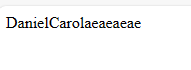

# javascript-Arrays
alguns testes de arrays no javascript. SIMPLES/ TERNÁRIO / ARRAY PARA REPETIR IMAGENS. Atividade rápida com o professor Anselmo no primeiro semestre do curso de Desenvolvimento de Sistemas na Etec de Guarulhos.
  

  <h3>Página Inicial. Aqui você escreve qual fruta você quer ver</h3>
  

  

  <h3>As frutasr</h3>
  

  

  <h3>O segundo projeto com array que mostra um certo texto de uma array</h3>
  

  

  <h3>O terceiro projeto que insere o seu texto na array</h3>
  

